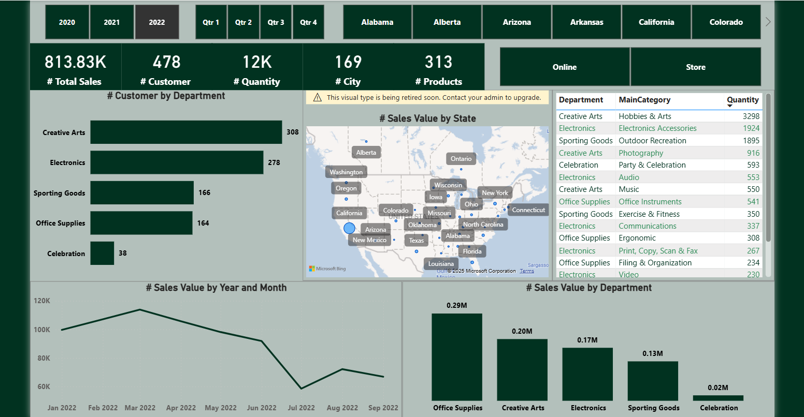

# 📊 Power BI Sales Dashboard | لوحة معلومات المبيعات

This is an **interactive sales dashboard** built using **Power BI**, created for **educational purposes**.  
هذه لوحة معلومات تفاعلية للمبيعات باستخدام Power BI، تم إنشاؤها لغرض **التعلم والتدريب**.

---

## 🎯 Project Objective | هدف المشروع

**EN:**  
Teach beginners how to build a professional dashboard using Power BI by analyzing sales data across different dimensions.

**AR:**  
تعليم المبتدئين كيفية بناء لوحة معلومات احترافية باستخدام Power BI من خلال تحليل بيانات المبيعات حسب أبعاد متعددة.

---

## 📌 Dashboard Features | مميزات لوحة المعلومات

- ✅ **KPI Cards** | بطاقات مؤشرات الأداء:
  - Total Sales | إجمالي المبيعات
  - Number of Customers | عدد العملاء
  - Quantity | الكمية
  - Cities | المدن
  - Products | المنتجات

- 🗓️ **Date Filters** | فلاتر التاريخ:
  - Year and Quarter | السنة والربع السنوي

- 🌍 **Map Visualization** | خريطة تفاعلية:
  - Sales Value by State | قيمة المبيعات حسب الولاية

- 🏬 **Sales Channels** | قنوات البيع:
  - Online vs Store | عبر الإنترنت مقابل المتجر

- 📊 **Charts** | الرسوم البيانية:
  - Sales Trend by Month | اتجاه المبيعات حسب الشهر
  - Sales by Department | المبيعات حسب القسم
  - Customers by Department | العملاء حسب القسم

- 🧾 **Table View** | جدول تفصيلي:
  - Department, Category, Quantity | القسم، الفئة، الكمية

---

## 🧠 Skills You’ll Learn | المهارات التي ستتعلمها

- Power BI basics | أساسيات Power BI  
- Data modeling | نمذجة البيانات  
- Using slicers and filters | استخدام الفلاتر والمحددات  
- Visualization best practices | أفضل ممارسات التصوير البياني  
- Optional DAX measures | مقاييس DAX (اختياري)

---

## 🖼️ Sample Dashboard | نموذج من اللوحة

---

## 🗂️ Files Included | الملفات المرفقة

| File | Description |
|------|-------------|
| `SalesDashboard.pbix` | Power BI dashboard file |
| `README.md` | This documentation file |

---

## 🚀 How to Use | كيفية الاستخدام

1. Download the `.pbix` file  
   قم بتحميل ملف Power BI `.pbix`  
2. Open it with **Power BI Desktop**  
   افتحه باستخدام برنامج Power BI Desktop  
3. Explore and modify the visuals  
   تصفح الرسوم البيانية وحاول تعديلها  
4. Replace data to build your own version  
   استبدل البيانات لتصميم نسختك الخاصة  

---

## 📚 Educational Purpose Only | للاستخدام التعليمي فقط

**EN:**  
The data used here is fictional or sample data for learning purposes.  
**AR:**  
البيانات المستخدمة هنا وهمية أو تجريبية لغرض التعلم فقط، وليست للاستخدام التجاري.
